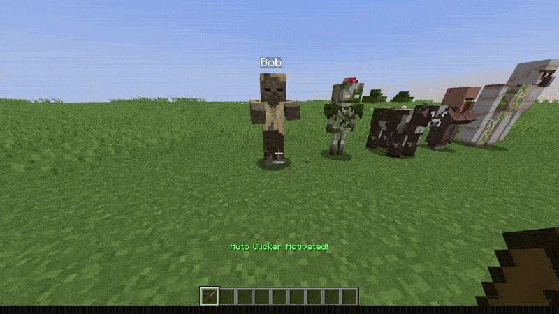
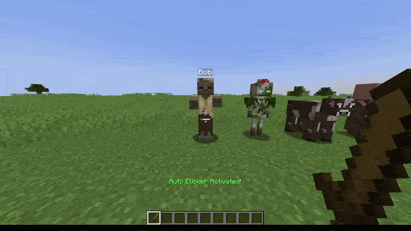
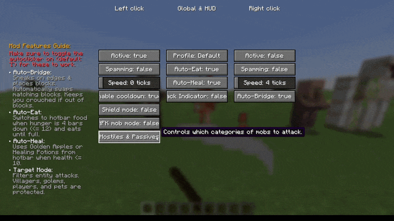
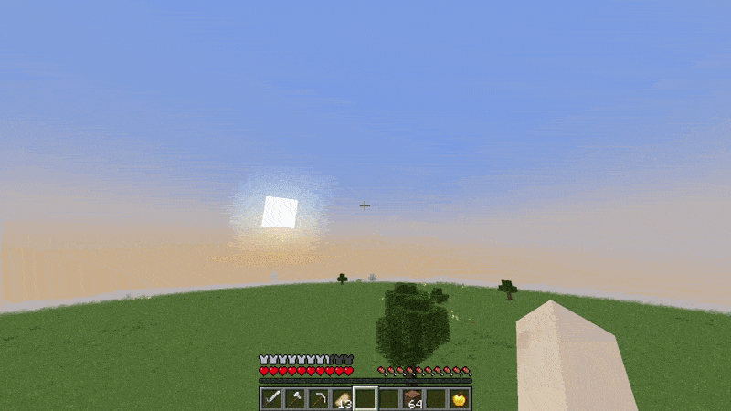

  

<h1 align="center">🎮 Better Auto Clicker</h1>

  <strong>A highly polished, feature-rich utility and automation mod for Minecraft Fabric.</strong>

  
  
  
  

---

## ✨ Introduction

**Better Auto Clicker** is a state-of-the-art utility mod designed to automate combat, bridging, eating, and healing in Minecraft. Featuring a modern, responsive three-column in-game settings GUI, preset profiles, and robust safety mechanisms, it integrates seamlessly into your client.

> [!TIP]
> **Looking for the Modrinth page?** You can find the direct description page, project updates, and releases here: **[Modrinth Page](https://modrinth.com/mod/auto-clicker-by-its_sxnu)**.

---

## ⚙️ Features

* **⚡ Advanced Clicking:** Fully configurable click automation for both Left (Attack) and Right (Use) buttons. Adjust delay, hold/press behavior, and clicking speeds via options.
* **⚔️ Cooldown-Synced Combat (AFK Mode):** Auto-attacks synchronize with your weapon's cooldown progress. Attack halts automatically when your shield is raised.
* **🎯 Entity Target Filters:** Choose target categories:
  * **All Mobs** — Attack any target in sight.
  * **Hostiles Only** — Attack monsters only.
  * **Passives Only** — Target animals/passive mobs.
  * **Hostiles & Passives** — Attack monsters and animals while protecting villagers, golems, pets, and players.
* **🌉 Auto-Bridging (SafeWalk & Place):** Safely places blocks while walking backwards/sideways on edges. Automatically swaps hotbar slots to matching block types, and **locks you in sneak** if you run out of blocks so you never fall.
* **🍎 Auto-Eat & Auto-Heal:** 
  * **Auto-Eat** — Swaps to food when hunger drops 4 bars down ($\le 12$) and eats until full.
  * **Auto-Heal** — Swaps to Golden Apples or Healing/Regen Potions when health drops to $\le 10$ (5 hearts).
* **🗃️ Preset Profiles:** Switch presets instantly (includes *Default*, *PVP Mode*, *AFK Mob Farm*, and *Block Bridging*).
* **📖 In-Game Guide Panel:** Built-in left and right guide panels explaining features and attack filters.

---

## 📽️ Visual Previews

### Combat Filters

<b>Click to expand combat filter previews</b>

#### All Mobs Mode

#### Hostiles Only Mode

#### Passives Only Mode

#### Hostiles & Passives Mode

### Auto-Bridging Demo

### Auto-Eating & Auto-Healing Demos

  
  

---

## 🚀 How to Use

1. Press **`O`** to open the custom three-column settings GUI.
2. Press **`I`** to globally toggle all active automation features ON/OFF.

> [!WARNING]
> Make sure to toggle the autoclicker on (default key: **`I`**) for automated features (like Auto-Bridge, Auto-Eat, and Auto-Heal) to function.
